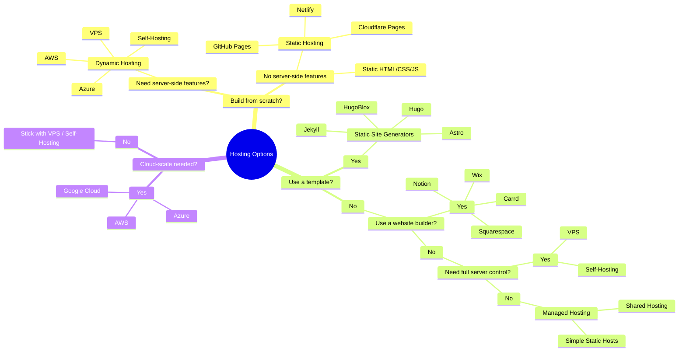

## Why Your Domain Matters
A personal domain gives you a simple way to take ownership of your online presence. It ensures people can find the correct information about you and not someone else with a similar name. Instead of relying on social platforms or temporary pages, your domain becomes a stable place you control.

It doesn’t need to be complicated. Whether you use it for a small site, documentation, a portfolio, or just a professional email address, a domain gives you one consistent location you can point everything to. If you ever change jobs, hosting providers, or platforms, your domain stays yours. It’s a practical step toward keeping your online identity organized and under your control.

## Chosing a Registrar
A registrar is the service that sells and manages your domain name. It handles your ownership records, renewals, and DNS settings, acting as the official link between you and the global domain registry systems.

Buying a domain early is often the right move because it prevents someone else from taking the name you want or spoofing your project later. Once a domain is registered, it’s gone unless the owner gives it up, and popular or meaningful names disappear quickly. Securing your domain early protects your idea, your identity, and your future brand before it grows into something others might try to imitate or claim for themselves.

[**Cloudflare**](https://www.cloudflare.com/) offers transparent pricing, strong security defaults, and free WHOIS privacy, making it a solid all-around choice for most users.

[**Porkbun**](https://porkbun.com/) provides low prices, free privacy, and a simple interface, appealing to anyone who wants an affordable but reliable option. 

[**Namecheap**](http://www.namecheap.com/) balances cost and usability, with straightforward management tools and free privacy on most domains. 

<a href="https://njal.la/about/">
  

[**Njalla**](https://njal.la/about/) caters to users who prioritize anonymity; it acts as a privacy buffer by holding domain ownership on your behalf, which can reduce personal exposure but may not fit every legal or organizational requirement. 

<a href="https://www.godaddy.com/">
  

[**GoDaddy**](https://www.godaddy.com/) remains one of the largest registrars, offering a broad ecosystem of services, though often at higher prices and with more upsells.

## Choosing a TLD (Domain Ending)
Your TLD affects how trustworthy your domain looks and how easy it is for others to impersonate you. For most people, .com is the safest choice. It’s the most recognized globally, the default people assume when typing a domain, and the hardest for someone else to spoof. If your handle is available in .com, it’s usually worth claiming for long-term stability.

#### .com
* Most recognized and trusted
* Often preferred for professional sites
* If you can get your name in .com, it’s never a bad choice.

#### .io

* Popular in tech - Good for portfolios or anything tech-related.
* Short, clean, modern
* Technically a country code, but widely accepted

#### .tech

* Clear meaning for technical work
* Usually easier to find available names
* Works well if your focus is technology or engineering.

#### .dev

* Secure by default (requires HTTPS)
* Recognized in developer communities
* More niche - Great for projects, documentation sites, or showcasing technical skills.

#### .me

* Personal and expressive
* Affordable
* Ideal for a personal site or resume-style domain.

#### .net, .org, others

* Solid alternatives if .com is taken
* Use these when you want something neutral or industry-appropriate.

If .com isn’t available or doesn’t fit your brand, modern TLDs like .io, .dev, or .tech are fine alternatives, especially in technical fields. They’re more available and still widely accepted, but they do carry a slightly higher impersonation risk simply because attackers often target unusual or trendy endings for look-alike domains.

## Hosting Options: Static, Dynamic, or Self-Hosted
Walk through GitHub Pages, VPS, or shared hosting. 

## Setting Up DNS Records
To make your domain actually do something, you set DNS records. These records tell the internet where to send traffic for your website, email, or other services. Most domains only need a few basic types, and each has a specific job.

### A Record
Points your domain to an IPv4 address.
If your server has an IP like 203.0.113.10, the A record tells browsers to load your site from that address.

### AAAA Record
Same purpose as an A record but for IPv6 addresses.
If your host supports IPv6, you can add both A and AAAA records so users on any network reach your site.

### CNAME Record
Points one hostname to another hostname instead of an IP.
Useful when you want something like www.yourdomain.com to point to your root domain, or when a service provider gives you a target like username.github.io.

### MX Record
Directs email for your domain to the correct mail server.
If you use a custom email provider, they will give you MX records that tell the world where to deliver mail for @yourdomain.com.

These four records cover almost everything a personal domain needs. Once they’re set up, your domain can host a website, send and receive email, and cleanly redirect subdomains wherever you want.

## Securing with HTTPS and DNSSEC
Add SSL certificates, enable DNSSEC, and discuss renewal automation.

## Privacy and Branding Benefits
Protect WHOIS data and reinforce personal brand identity.

## Conclusion: Control Your Digital Footprint
Close with encouragement to make the domain your central online anchor.
